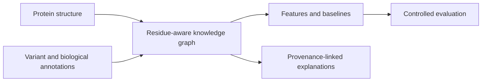

# TrustProtKG

**A provenance-aware protein structure knowledge graph for explainable missense-variant research.**

단백질 잔기 수준의 구조 정보와 기능·질병·경로 정보를 연결하고, 변이 해석에 사용한 근거의 출처를 추적하는 연구 프로토타입입니다.

## What is implemented

- PDB/AlphaFold-style structure parsing and residue-contact graphs.
- A heterogeneous graph of proteins, residues, variants, domains, GO terms, diseases, and pathways.
- Per-edge provenance: source database, evidence type, confidence, timestamp, and derivation.
- Variant features, baseline evaluation, protein-held-out comparisons, graph features, perturbation analysis, and calibration utilities.
- Local synthetic/curated demonstration inputs and focused regression tests.



## Quick start

Python 3.11+.

```bash
python -m venv .venv
# Activate .venv using your operating system's command.
python -m pip install -e ".[dev]"
trustprotkg --config configs/demo.yaml
python -m pytest tests -q
```

The demo runs locally and exports JSONL/GraphML graphs and variant-feature tables. It does not download live clinical databases. `configs/benchmark.yaml` selects a small local benchmark.

## Core modules

| Component | Role |
|---|---|
| `structure.py`, `kg.py` | Residue contacts and heterogeneous graph construction |
| `features.py`, `evaluation.py` | Variant features and baseline evaluation |
| `cross_protein.py`, `graph_baselines.py`, `graph_ml.py` | Generalization and graph-based comparisons |
| `explanation_quality.py`, `perturbation.py` | Explanation and evidence-sensitivity analysis |
| `ingestion.py`, `snapshot_diagnostics.py` | Local data ingestion and evidence diagnostics |

## Scope

This repository presents the scientific core of a larger local workspace. Repetitive report-navigation, review-packet, and manuscript-administration modules are excluded. Small local demonstrations are not clinical validation, and synthetic/curated evidence must not be described as a representative patient cohort.

## Publication and validation

This is a curated research source snapshot, not the complete local experiment archive.
See [validation](VALIDATION.md), [publication scope](PUBLICATION_NOTES.md), and [credential handling](SECURITY.md).
