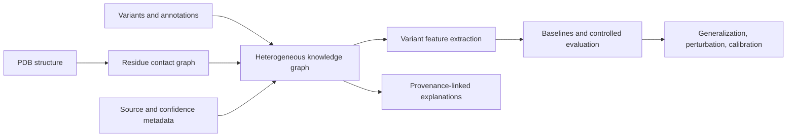

# TrustProtKG

**단백질 잔기 구조와 생물의학 지식그래프를 연결하는 출처 추적형 변이 해석 연구**

> A provenance-aware protein structure knowledge graph for explainable missense-variant research.

TrustProtKG는 단백질의 3차원 잔기 관계와 기능·domain·pathway·질병 정보를 하나의 그래프로 연결한다. Missense variant의 위치에서 출발해 어떤 구조적·생물학적 근거가 특징과 설명에 사용되는지 추적할 수 있도록, 관계마다 출처와 신뢰도 정보를 보존하는 것이 중심 설계다.

| 항목 | 내용 |
|---|---|
| 연구 분야 | Protein structure, knowledge graph, explainable variant research |
| 기본 단위 | 단백질·구조모델·잔기·변이·생물학적 annotation |
| 주요 기술 | Python, NetworkX, Biopython, pandas, NumPy, Pydantic |
| 입력 | Local PDB/AlphaFold-style PDB와 CSV annotation |
| 출력 | JSONL/GraphML 그래프, 변이 특징, baseline 예측·지표, 설명 |

## 1. 해결하려는 문제

변이 해석에 쓰이는 정보는 여러 수준에 걸쳐 있다. 서열상 위치가 같아도 잔기의 공간적 주변 환경, 구조의 신뢰도, domain과 기능 annotation, 질병·pathway 연결에 따라 근거의 의미가 달라질 수 있다.

이 프로젝트는 이러한 정보를 단순히 한 표에 합치는 대신, **관계와 그 관계의 출처**를 함께 표현한다. 이를 통해 특징을 계산하거나 설명을 생성할 때 사용된 근거를 다시 확인할 수 있게 한다. 출처를 저장하는 기능과 그 근거의 생물학적 타당성이 검증되었다는 주장은 구분한다.

## 2. 처리 흐름



구조 parser가 잔기와 좌표를 읽고 접촉 관계를 구성한다. KG builder는 해당 잔기를 단백질·변이·annotation과 연결한다. 이후 특징 추출과 baseline 평가, 근거 경로 설명을 수행하며, 필요하면 cross-protein 또는 perturbation 조건에서 결과를 비교한다.

## 3. 그래프 스키마

### Node 종류

| Node | 의미 |
|---|---|
| `Protein` | 단백질 단위의 식별 정보 |
| `StructureModel` | 입력 구조모델 |
| `Residue` | Chain·잔기 위치·좌표 등 |
| `Variant` | 해석 대상 변이와 위치 |
| `Domain` | 기능적 domain annotation |
| `GO_Term` | 기능 관련 ontology term |
| `Disease` | 연결된 질병 annotation |
| `Pathway` | 생물학적 pathway annotation |

관계에는 `HAS_STRUCTURE`, `HAS_RESIDUE`, `HAS_DOMAIN`, `HAS_FUNCTION`, `PARTICIPATES_IN`, `ASSOCIATED_WITH`, `LOCATED_AT`, `SEQUENCE_NEIGHBOR`, `STRUCTURAL_CONTACT`가 있다. Node·edge 정의는 [models.py](trustprotkg/models.py), 실제 구성은 [kg.py](trustprotkg/kg.py)에 있다.

### Edge provenance

| 필드 | 의미 |
|---|---|
| `source_db` | 근거의 출처 |
| `evidence_type` | 관계를 지지하는 근거의 유형 |
| `confidence` | 해당 기록의 confidence 값 |
| `created_at` | 기록 시점 |
| `derived_from` | 생성·가공의 기원 |

값을 저장했다는 사실만으로 실제로 잘 보정된 confidence가 되는 것은 아니다. 구조 confidence 역시 입력의 의미를 확인해야 한다. AlphaFold-style PDB에서 사용하는 pLDDT-like 값과 일반 실험 PDB의 B-factor를 같은 생물학적 지표로 해석하지 않는다.

## 4. 입력과 출력

### 필요한 입력

| 입력 | 역할 |
|---|---|
| Protein·variant CSV | 단백질과 변이 식별·위치 정보 |
| GO·disease·domain·pathway CSV | 생물학적 annotation |
| PDB 파일 또는 구조 목록 | 잔기와 공간적 이웃 구성 |
| YAML 설정 | 입력 경로, 접촉 거리 기준, provenance, 출력 위치 |

[데모 설정](configs/demo.yaml)은 local toy input을 사용한다. 기본 contact threshold는 **8.0 Å**다. [Benchmark 설정](configs/benchmark.yaml)은 구조 목록과 여러 annotation을 읽고 평가 산출물까지 생성한다.

### 생성되는 산출물

- JSONL 및 GraphML 형식의 이종 그래프
- Variant feature table
- Benchmark 조건의 baseline metrics와 predictions
- 근거를 연결한 variant explanation 기록
- 선택한 실험의 단백질 간 일반화·perturbation·calibration 결과

`outputs/`와 `experiments/runs/` 등의 실행 산출물은 로컬에서 생성되며 공개본의 원시 입력과 구분한다.

## 5. 평가 구성

| 평가 관점 | 확인하려는 내용 | 관련 모듈 |
|---|---|---|
| Baseline | 구성한 특징으로 예측과 평가가 가능한가? | `evaluation.py` |
| Protein-held-out | 동일 단백질 안의 평가와 다른 단백질 일반화가 다른가? | `cross_protein.py` |
| Graph features | 그래프 관계가 어떤 추가 표현을 제공하는가? | `graph_baselines.py`, `graph_ml.py` |
| Explanation quality | 설명과 사용 근거를 정해진 기준으로 검사할 수 있는가? | `explanation_quality.py` |
| Perturbation | 근거를 변경했을 때 출력이 어떻게 달라지는가? | `perturbation.py` |
| Calibration | 예측 점수·threshold·class balance를 어떻게 해석해야 하는가? | `model_calibration.py` |
| Snapshot diagnostics | 입력 출처·label leakage·근거 조건에 문제가 없는가? | `snapshot_diagnostics.py` |

여기서 설명하는 것은 구현된 평가 기능이다. 기능이 존재한다는 사실을 실제 임상 cohort에서의 높은 성능이나 충분한 외부 검증 결과로 바꾸어 주장하지 않는다.

## 6. 로컬 실행

**Python 3.11+**를 사용한다.

```bash
git clone https://github.com/CHOMINWOO1/TrustProtKG.git
cd TrustProtKG
python -m venv .venv
```

가상환경 활성화 후:

```bash
python -m pip install -e ".[dev]"
trustprotkg --config configs/demo.yaml
python -m pytest tests -q
```

데모는 live database download 없이 local input으로 실행된다. 공개 준비 과정에서 확인한 출력은 **16 nodes, 54 edges**의 그래프였다. 이는 toy graph의 크기이며 성능 지표가 아니다.

작은 benchmark 입력으로 평가 산출물까지 확인하려면 다음 설정을 사용한다.

```bash
trustprotkg --config configs/benchmark.yaml
```

이 설정은 `outputs/benchmark/`에 그래프·특징·baseline metrics·prediction·설명을 출력하도록 구성되어 있다. 입력을 바꾸려면 [configs/](configs/)와 [data/](data/)의 schema 및 provenance를 함께 확인한다.

## 7. 코드 탐색

| 위치 | 역할 |
|---|---|
| [structure.py](trustprotkg/structure.py) | PDB parsing과 residue graph |
| [kg.py](trustprotkg/kg.py) | 이종 KG 구성 |
| [features.py](trustprotkg/features.py) | 변이 특징 추출 |
| [pipeline.py](trustprotkg/pipeline.py) | 입력에서 출력까지의 기본 파이프라인 |
| [explanations.py](trustprotkg/explanations.py) | 변이 근거 설명 |
| [ingestion.py](trustprotkg/ingestion.py) | Local snapshot 입력 처리 |
| [experiments/configs/](experiments/configs/) | 선별된 과학 실험 설정 |
| [tests/](tests/) | 구조·KG·특징·평가 관련 회귀 테스트 |

## 8. 검증과 해석 범위

선별된 과학 핵심 기능의 **33개 테스트가 통과**했고, 실제 Git 파일만 추출한 별도 디렉터리에서도 동일 범위를 확인했다. 입력은 local synthetic/curated demonstration이며 대표적인 환자 cohort로 해석하지 않는다.

구조 품질, annotation 누락, 데이터 선택과 label 구성은 결과에 영향을 줄 수 있다. Prototype의 근거 추적 기능이 임상적 정확성을 보장하지 않으며, 이를 판단하려면 독립적인 데이터·설계·평가가 필요하다.

## 9. 이 프로젝트에서 확인할 수 있는 작업

단백질 구조 parsing과 이종 그래프 schema 설계, provenance 보존, 변이 특징·설명 생성, 평가 조건 분리와 자동화가 핵심이다. 원래 작업 공간에 누적된 반복적인 보고서 탐색·검토 packet·원고 행정 모듈은 공개본에서 제외하고 과학 코드 중심으로 구성했다.

## 공개 범위와 추가 문서

이 저장소는 원래 작업 폴더에서 핵심 코드·테스트·설정·작은 예제·대표 결과를 선별한 공개본이다. 대용량 데이터·가중치, 인증정보, 내부 실행 기록과 중복 문서 생성 산출물은 제외했다. 기존 논문·실험 수치는 기록된 결과이며 이번 README 개정에서 재측정하지 않았다.

- [실행한 검증과 한계](VALIDATION.md)
- [공개본 구성과 재사용 조건](PUBLICATION_NOTES.md)
- [인증정보와 로컬 설정 관리](SECURITY.md)

초기 공개본에는 별도 오픈소스 재사용 라이선스를 부여하지 않았다. 제3자 모델·데이터·의존성은 각 원 출처의 이용 조건을 따른다.
