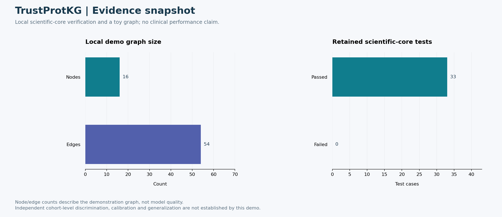

# TrustProtKG: 실험 결과와 진행 상태

이 문서는 공개본에 보존된 실험·검증 기록을 시각화한 것이다. 원래 학습·과학 실험을 새로 수행했다는 의미는 아니다. 기능 테스트, 합성 데모, 실제 성능 지표를 서로 구분한다. 진행률의 임의 퍼센트는 사용하지 않는다.



## 결과 해석

공개본에서 확인한 16 nodes·54 edges는 toy graph 규모이며 예측 성능 지표가 아니다. 선별된 과학 핵심 테스트 33개가 통과했지만 임상 cohort나 독립 단백질 일반화 성능의 증거로 사용할 수 없다.

## 현재 진행 상태

| 항목 | 확인된 상태 |
|---|---|
| 구조·KG·출처 추적 | 핵심 구현 및 local demo 실행 |
| 공개본 테스트 | 33개 통과 |
| 예측 성능·보정 | 독립 평가 근거 추가 필요 |
| 임상적 유효성 | 현재 주장하지 않음 |

## 다음 보완 과제

1. 단백질 단위 분리와 label leakage 점검을 포함한 외부 평가
2. sequence-only·structure-only·KG 결합 baseline 비교
3. 결측 annotation·구조 신뢰도·근거 perturbation에 대한 민감도 분석

## 보안 범위와 남은 검증

공개 입력은 local toy/curated demonstration이다. 실제 환자 변이 및 질병 연결 정보를 사용할 경우 식별 정보와 민감한 annotation을 별도로 관리해야 한다. provenance 저장이 데이터 적법성이나 임상 타당성을 보장하지 않는다.
`.gitignore` 외에 공개 파일 내용도 검사했다. 이전에 유출된 비밀정보를 ignore 규칙만으로 회수할 수는 없다.

## 근거와 그림 재현

- [VALIDATION.md](../../VALIDATION.md)
- [configs/demo.yaml](../../configs/demo.yaml)
- [그림의 수치와 조건](metrics.json)
- [확대 가능한 SVG](results.svg)
- [그림 재생성 코드](reproduce_figures.py)

```bash
python -m pip install matplotlib
python docs/portfolio-results/reproduce_figures.py
```

원시 실험 재현은 각 프로젝트의 본문 프로토콜을 따른다. 위 명령은 보존된 수치로 그림만 다시 만든다.
